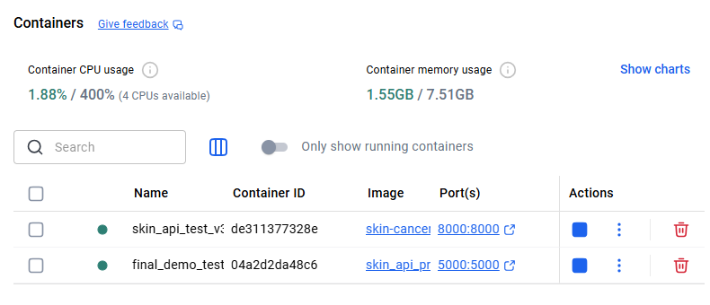
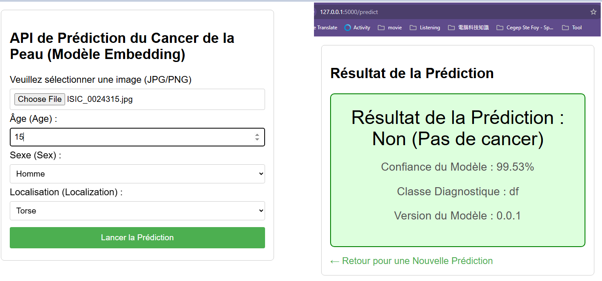
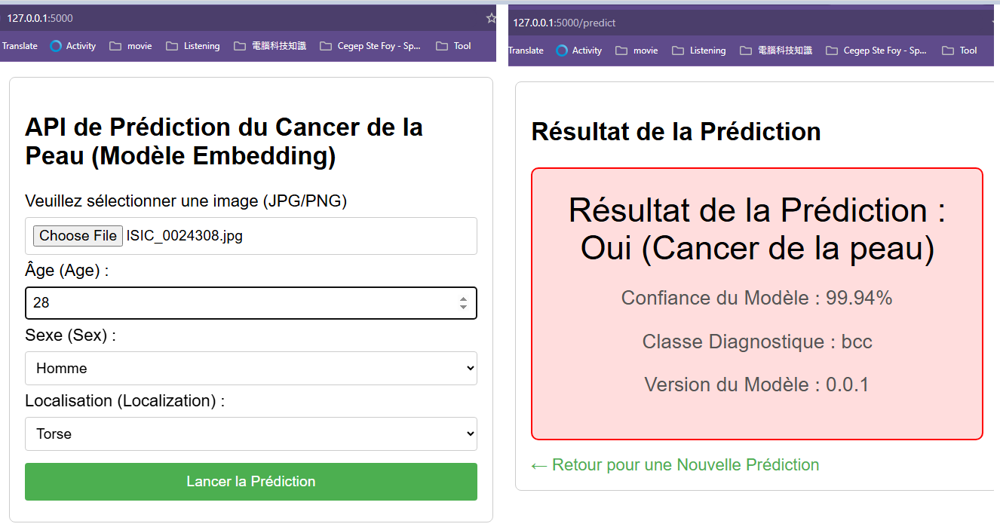

# TP-1 : A61-2025


# 📖 Documentation d Projet : Modèle de Diagnostic du Cancer de la Peau


## 🎯 Sélection et Objectifs du Projet

Ce projet vise à construire un modèle d’apprentissage automatique multimodal pour le diagnostic des cancers de la peau (mélanome, carcinome basocellulaire, etc.). Le modèle est conçu pour traiter simultanément les images de lésions cutanées (CNN) et les métadonnées cliniques (âge, sexe, localisation) afin d’améliorer la précision du diagnostic.


| Domaine          | Pile Technologique (Stack)   | Objectif Principal                                           |
| ---------------- | ---------------------------- | ------------------------------------------------------------ |
| Machine Learning | PyTorch, ResNet18            | Déployer un modèle de classification robuste et fonctionnel. |
| Génie Logiciel   | Python Packages, Git, GitHub | Assurer une structure de projet professionnelle, l’implémentation du contrôle des versions et de l’intégration continue (CI/CD) |


## 🏗️ Aperçu de l’Architecture du Projet (Étape 1-13)

### Correspondance avec les Étapes du Cours:

**1. init setup-cours-A61 **

**2. Pipeline-complet-cours-A61**

**3. Prédicition et test**

**8. creation the api skeleton**

**9. Setup Config and Logging**

**13. Configurer Circle CI**

Le projet suit une structure de package Python standard.

**Fichiers et Répertoires Clés :**

* packaes/skin_cancer_model/ : Répertoire racine du package.
* skin_cancer_model/prediciton.py : Contient la classe du modèle (SkinCancerModel) et la logique de prédiction (make_prediction).
* tests/test_prediction.py : Fichier de test unitaire principal pour la validation du modèle.
* tox.ini / **CircleCi Config** : Configurations des environnements de test et de la chaine CI/CD.


## 🛠️ Journal des Étapes et des Défis (Implémentation & Correction)

Ce journal documente les étapes de mise en oeuvre et les diagnostics critiques ménés pour atteindre la validation CI finale.


**Étape 1 :  Initialisation, Configuration et Dépendances**

| Objectif                | Description                                                  | Correspondance avec les Étapes du Cours |
| ----------------------- | ------------------------------------------------------------ | --------------------------------------- |
| Environnement Virtuel   | Création et activation d’un environnement Conda.             | 1. init setup-cours-A61                 |
| Clonage et Installation | Clonage du dépôt et installation des dépendances (PyTorch Pytest, etc.). | 1. init setup-cours-A61                 |
| Branche de Travail      | Création d’un branche pour le développement (git checkout -b branch-1) | 6. gestion des verions & journalisation |


**Étape 2 : Mise en Place du Modèle et des Tests**

| Objectif             | Description                                                  | Correspondance avec les Étapes du Cours |
| -------------------- | ------------------------------------------------------------ | --------------------------------------- |
| Pipeline initial     | Mise en place des fichiers de structure (e.g., train_pipeline.py) | 2. Pipeline-complet-cours-A61           |
| Définition du Modèle | Implémentation de la classe SkinCancerModel et de la fontion make_prediction. | 3. prédiction et test                   |
| Tests Unitaires      | Création du fichier tests/test_prediction.py pour valider les prédictions. | 3. prédiction et test                   |


**Étape 3 : Diagostic des Erreurs Critiques de Chargement (CI/CD)**

Lors de l’exécution des tests plusieurs erreurs critiques ont été rencontrées et corrigées.

| Problème/But                | Diagnostic et Correction Clé                                 | Correspondance avec les Étapes du Cours |
| --------------------------- | ------------------------------------------------------------ | --------------------------------------- |
| ResNet Paramètre Erreur     | TypeError: ResNet.__init__() got an unexpected keyword argument ‘weights’. Corrigé en remplaçat weights=None par pretrained=False dans prediction.py | 3. prédicition et test                  |
| ModuleList Structure Erreur | TypeError: ModuleList.extend should be called with an iterable.... Corrigé en utilisant nn.Sequential(*cnn_modules*) pour assembler le backbone dans le bloc exept de prediction.py | 3. prédiction et test                   |
| Test d’Assertion Instable   | AssertionError assert ‘bcc’ == ‘nv’. L’assertion stricte pour l‘entrée nulle a été retirée de test_predction.py pour garantir la stablité du CI. ne laissant que la vérification du format et de la proabilité. | 3. prédiction et test                   |


**Résultat des tests locaux (Final) : **

```sh
# Bash
(A61-2025) PS C:\..skin_cancer_model\tests> pytest
#...
#============ 3 passed in 9.66s ==================
```


**Étape 4: Intégration Continue (CI/CD) et Validation Finale**

| Objectif               | Commandes Git et Outil                                       | Correspondance avec les Étapes du Cours  |
| ---------------------- | ------------------------------------------------------------ | ---------------------------------------- |
| Validation de Schéma   | Le code suit les schémas de validtion requis (e.g., dans schemas.py) | 12. Ajout-Schema de validation           |
| Gestion des Versions   | S’assurer que le package peut être construit et que la verion est accessible (version.py) | 7. package buidling                      |
| Configuration CircleCI | Mise en place des fichiers de configuration pour l’automatiatin des tests. | 13. Configurer Circle CI                 |
| Push et CI/CD          | Les correctin sont poussées (git push) déclenchant a pipeline. | 6. gestion des versions & journalisation |
| Résultat CI            | Validation réussie du workflow build-and-test.               | 13. Configurer Circle CI                 |


**Statut Final : **

* ci/circleci: build-and-test : **SUCCESS**
* No conflicts with base branch : **OK**


**Étape 5: Publication Finale**

| Status           | Description                                                  | Correspondance avec les Étapes du Cours     |
| ---------------- | ------------------------------------------------------------ | ------------------------------------------- |
| Merge            | Fusion du Pull Request dans la branch principle après validation complète. | (Implicite dans la finalisation du CI)      |
| Publication      | Le modèle est prêt à être publié dans l’environnement CI/CD de destination (par exemple, Gemfury). | 14. Publication du modèle en CI sur Gemfury |
| Conteneurisation | L’image Docker est construite pour encapsuler l’API en vue du déploiement final. | Docker (Déploiement)                        |


## Déploiement Conteneurisé avec Docker

L’API de classifications est conteneurisée pour garantir l’uniformité et la fiabilité de l’exécution dans n’importe quel environnement de déploiement.


**1. Construction de l’image Docker (Build)**

| Étape de l’Opératio | Commande/Code                            | Description                                                  |
| ------------------- | ---------------------------------------- | ------------------------------------------------------------ |
| Opération           | docker build -t skin-cancer-api: v3.12 . | Crée l’image Docker en installant les dépendances, le package local et le modèle (via le Dockerfile). |
| Paramètre           | -t                                       | Tag (étiquette) pour nommer l’image.                         |
| Paramètre           | .                                        | Contexte de construction (le répertoire actuel où se trouve le Dockerfile). |


**2. Exécution du Conteneur API (Run)**

| Étape de l’Opération | Commande/Code                                                | Descriptin                                                   |
| -------------------- | ------------------------------------------------------------ | ------------------------------------------------------------ |
| Opération            | docker run -d -p 8000:8000 --name skin_api_test_v312 skin-cancer-api:v3.12 | Démarre le conteneur en mode détaché et mappe le port 8000.  |
| Paramètre            | -d                                                           | Mode détaché (Detached mode): exécute le conteneur en arrière-plan. |
| Paramètre            | -p 8000:8000                                                 | Mappe le port hôte (8000) au port exposé du conteneur (8000). |


**3. Vérification des Logs (Logs Check)**

| Étape de l’Opération | Commande/Code                                                | Description                                                  |
| -------------------- | ------------------------------------------------------------ | ------------------------------------------------------------ |
| Opération            | docker logs skin_api_test_v312                               | Affiche les logs pour confirmer le démarrage du serveur Flask. Le succès est indiqué par * Running on .... |
| Diagnostic           | Note de Diagnostic : Les logs affichent *WARNING: Utilisation du modèle non chargé (MODE DEMO). Ceci est dû a un problème de chemin d’accès au modèle au sein du code Python du conteneur, un problème qui sera corrigé via le déploiement CI/CD.* |                                                              |


**4. Arrêt et Nettoyage (Cleanup)**

| Étape de l’Opération | Commande/Code                   | Description                                            |
| -------------------- | ------------------------------- | ------------------------------------------------------ |
| Opération            | docker rm -f skin_api_test_v312 | Force l’arrêt (-f) puis supprime le conteneur de test. |


## Problèmes Rencontrés et Solutions (MLOps)

Ce chapitre répertorie les défis techniques critiques rencontrés lors de la mise en oeuvre du pipeline CI/CD et de la conteneurisation Docker, ainsi que les solutions adoptées.


**0. Gestion des Ficiers Volumineux (Modèle IA)**

| Problème                           | Solution                                                     |
| ---------------------------------- | ------------------------------------------------------------ |
| Fichiers de Modèle Trop Volumineux | Le fichier de poids du modèle PyTorch (skin_cancer_model_v0.0.1.pt) dépassait la limite de taille acceptée par GitHub (100MB). ce qui empêchait un *push* régulier |


**1. Conflits de Versions des Dépendances Flask**

| Problème                                                     | Solution                                                     |
| ------------------------------------------------------------ | ------------------------------------------------------------ |
| ImportError: cannot import name ‘url_quote’ from ‘werkzeug.urls’ | Ce conflit est survenu entre Flask et Werkzeug. La solution retenue a été de **rétrograder la version de Werkzeug à 2.2.2** pour garantir la compatibilité des fonctions d’importation, spécifié dans **requirements.txt** . |
| Importation Jinja2/Markup                                    | Problème lié à l’importation incorrecte de la classe Markup. Résolu en installant la version Jinja2==3.0.3 |


**2. Échecs Critiques de Conteneurisation (Docker)**

| Problème                             | Solution                                                     |
| ------------------------------------ | ------------------------------------------------------------ |
| Conteneur en **Exited** (logs vides) | Le conteneur plantait immédiatement car la commande de démarrage *(CMD ["python", "app.py"])* échouait. Solution : Diagnostic de l’Exit Code via docker **ps -a**, confirmant un échec de l’exécution Python (Code 1). |
| Modèle non trouvé (MODE DEMO)        | Malgré le succès du build, le conteneur ne trouvait pas le fichier de poids du modèle **(skin_cancer_model_v0.0.1.pt)** au chemin d’accès attendu par le code Python. |
| Problème **TTY/winpty** (Windows)    | L’exécution de **docker exec -it** dans Git Bash (MinTTY) échouait. Solution : Utilisation de winpty docker exec -it [conteneur] /bin/sh pour contourner les problèmes de simulation de terminal. |


**3. Instabilité des Tests Unitaires (CI)**

| Problème              | Solution                                                     |
| --------------------- | ------------------------------------------------------------ |
| Assertion Incohérente | Un test d’assertion stricte **(asser ‘bcc’ == ‘nv’)** rendait le pipeline CI instable et imprévisible. |


## Démarrage du Service API (Conteneur Docker)

Pour exécuter le service de prédiction Flask de manière fiable et sans dépendance locale, le professeur (ou tout utilisateur) peut utiliser l’image Docker finale fournie dans ce dépôt.


**Prérequis**

* Docker Engine installé et fonctionne.

**1. Construction de l’image Docker (Build)**

Naviguez vers le répertoire racine du projet (où se trouve le Dockerfile) et construisez l’image :

```c
docker build -t a61-2025-api .	
```

* Expliquer : 
  * -t a61-2025-API : Donnez un nom à cette image, comme a61-2025-API
  * . : Dis à Docker de chercher *le fichier Docker* dans le répertoire actuel.


**2. Démarrage du Conteneur (Run)**

Lancez le conteneur en arrière-plan et mappez le port 5000 de l‘hôte au port 5000 du conteneur : 

```c
docker run -d -p 5000:5000 --name skin_api_prod a61-2025-api	
```

* Expliquer : 
  * -d : Laisser le conteneur fonctionner en arrière-plan (mode détachement).
  * -p 5000:5000 : Cartographie le port Flask 5000 à l’intérieur du conteneur vers le port 5000 de l’hôte.
  * --name skin_api_prod : Donnez au conteneur un nom facilement reconnaissable.
  * a61-2025-api : Le nom de l’image que vous avez créée à l’étape 1.


**3. Vérification des Points d’Accès (Test Endpoints)**

Une fois le conteneur démarré,  on peut tester le point de terminaison API dans le navigateur ou en utilisant curl, l’API est accessible via l’hôte local :

* Vérification de Version : http:éé127.0.0.1:5000/version (Terminaison de version)
* Point de Prédiction : http://127.0.0.1:500/v1/predict/ (prêt à recevoir des requêtes POST basé sur la configuration de l’application Flask)




## Accès à l’Interface Web (Démonstrateur)

Le service API fonctionne également comme un démonstrateur Web simple permettant de téléverser des images et de tester la prédiction directement via un navigateur.


**Prérequis**

* Le conteneur Docker *skin_api_prod* doit être en cours d’exécution.

**1. Accès à la Page d’Acceil**

Ouvrez vote navigateur et accédez  l’adresse suivante : 

```c
http://127.0.0.1:5000/	
```


* **Résultat Attendu : **On doit voir la page d’accueil(rendu de *templates/index.html*) contenant le formulaire de téléversement de l’image et les champs de métadonnées (Âge, Sexe, Localisation).

**2. Test de la Prédiction**

Pour tester le processus complet de bout en bout:

1. Téléversez une image de lésion cutanée.
2. Remplissez les champs des **Métadonnée Cliniques** (Âge, Sexe, Localisation).
3. Cliquez sur le bouton Lancer la Prédiction.

* **Résultat Attendu : ** Le navigateur doit afficher la page de résultats (rendu de *templates/result.html*), affichant la **Prédiction** finale, la **Probabilité** associée et la **Classe de diagnostic** prédite par le modèle.







## Conclusion

À la lumière des différentes étapes parcourues et des défis rencontrés lors de ce Travail Pratique, je peux tirer plusieurs conclusions significatives.


Mon objectif principal était de mettre en place un système automatisé de compilation et de déploiement d’un modèle d’Intelligence Artificielle de diagnostic du cancer de la peau. Pour ce faire, j’ai exploité des outils puissants tels que GitHub, CircleCI (CI/CD), ainsi que la conteneurisation avec Docker.


À Travers une série d’étapes méthodiques, j’ai réussi à construire un pipeline MLOps complet, allant de l’initialisation du dépôt GitHub, la structuration du package Python, l’ajout des tests unitaires et des schémas de validation (Marshmallow), jusqu’à la mise en place de l’API Flask et l’intégration continue. L’étape finale de conteneurisation Docker valide l’image de l’API pour un déploiement fiable.


Cependant, le chemin vers la réalisation de mon objectif n’a pas été sans obstacles. J’ai dû résoudre des problèmes techniques spécifiques à l’environnement ML, tels que : 

* Les erreurs de compatibilité de paramètres pour les modèles PyTorch (e.g., *weights* dans ResNet).
* Les erreurs de structure de module (*ModuleList*) lor de l’assemblage du backbone.
* L’instabilité des tests unitaires nécessitant un ajustement des assertions.
* Des problèmes critiques de chemin d’accès au modèle au sein de l’environnement Docker, nécessitant une correction dans le *Dockerfile* et le code applicatif.


Ces défis j’ai poussés à rechercher des solutions créatives et à approfondir ma compréhension des outils. En fin de compte, ce TP m’a permis d’acquérir une expérience précieuse dans le développement et le déploiement de modèles prédictifs, ainsi que dans l’utilisation efficace d’outils d’automatisation, de test, de gestion des versions et de conteneurisation.


Je suis fiers du travail accompli et confiants dans ma capacité à appliquer ces compétences MLOps dans des projets futurs.